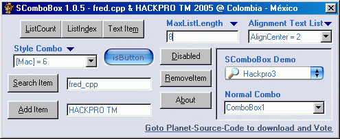



## SComboBox 1\.0\.5 Final version for PSC

### Description

New in this version 1.0.5 (Update: 2005-04-13)

- Now MouseWheel is support.

- Add the Subclassing of Paul Caton.

- Gray Icon add thanks to MArio Florez.

- Load a Recordset from a Database (Idea from Luciano).

- DrawList now work thanks to the Carles control.

Thank you for all those that contributed in this control.
 
### More Info
 

             |
---                |---
**Submitted On**   |2006-05-04 21:48:06
**By**             |[Heriberto Mantilla Santamaria](https://github.com/Planet-Source-Code/PSCIndex/blob/master/ByAuthor/heriberto-mantilla-santamaria.md)
**Level**          |Advanced
**User Rating**    |4.8 (53 globes from 11 users)
**Compatibility**  |VB 5\.0, VB 6\.0
**Category**       |[Custom Controls/ Forms/  Menus](https://github.com/Planet-Source-Code/PSCIndex/blob/master/ByCategory/custom-controls-forms-menus__1-4.md)
**World**          |[Visual Basic](https://github.com/Planet-Source-Code/PSCIndex/blob/master/ByWorld/visual-basic.md)
**Archive File**   |[SComboBox\_199210542006\.zip](https://github.com/Planet-Source-Code/heriberto-mantilla-santamaria-scombobox-1-0-5-final-version-for-psc__1-61605/archive/master.zip)

